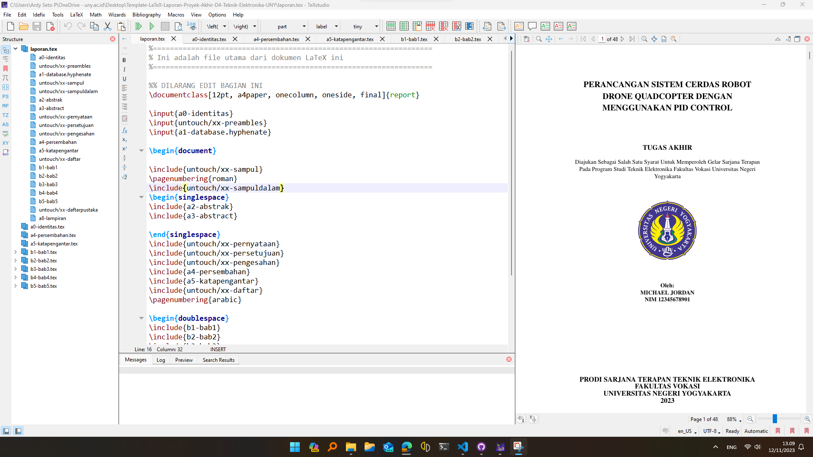

# 📘 Template LaTeX Laporan Tugas Akhir

*Program Sarjana Terapan Teknik Elektronika – Universitas Negeri Yogyakarta*

Template ini dirancang untuk mempermudah penulisan Proposal dan Laporan Tugas Akhir bagi mahasiswa D4 Teknik Elektronika UNY. Template ini memastikan keseragaman format, efisiensi penulisan, serta kemudahan kolaborasi dan pengelolaan dokumen melalui Git atau Overleaf.

---

## 📁 Struktur Proyek

```
Template-LaTeX-Laporan-Tugas-Akhir
├── CHANGELOG                         # Catatan perubahan
├── LICENSE                           # Lisensi proyek        
├── Project                           # Folder proyek    
│   ├── a0-identitas.tex              # Isi identitas laporan 
│   ├── a1-database.hyphenate.tex     # Database untuk hyphenation
│   ├── a2-abstrak.tex                # Abstrak dalam Bahasa Indonesia  
│   ├── a3-abstract.tex               # Abstrak dalam Bahasa Inggris
│   ├── a4-persembahan.tex            # Persembahan
│   ├── a5-katapengantar.tex          # Kata Pengantar
│   ├── a6-daftarsingkatan.tex        # Daftar Singkatan
│   ├── a7-pustaka.bib                # Daftar pustaka dalam format BibTeX
│   ├── a8-lampiran.tex               # Lampiran
│   ├── b1-bab1.tex                   # BAB I - Pendahuluan
│   ├── b2-bab2.tex                   # BAB II - Tinjauan Pustaka
│   ├── b3-bab3.tex                   # BAB III - Metode Penelitian
│   ├── b4-bab4.tex                   # BAB IV - Hasil dan Pembahasan
│   ├── b5-bab5.tex                   # BAB V - Kesimpulan dan Saran
│   ├── b6-bab6.tex                   # BAB VI - Tutorial LaTeX (opsional)
│   ├── gambar                        # Folder untuk menyimpan gambar
│   │   ├── gambar-kucing.jpg
│   │   ├── logo-uny.png
│   │   ├── screenshot-miktex.png
│   │   ├── screenshot-overleaf.png
│   │   ├── screenshot-texstudio-macos.png
│   │   └── screenshot-texstudio-windows.png
│   ├── kode                          # Folder untuk menyimpan kode program
│   │   ├── code_sample.cpp
│   │   ├── code_sample.ino
│   │   ├── code_sample.java
│   │   └── code_sample.py
│   ├── laporan.pdf                   # Hasil kompilasi laporan
│   ├── laporan.tex                   # File utama untuk kompilasi laporan
│   └── untouch                       # Folder untuk menyimpan file yang tidak perlu diubah
│       ├── xx-daftar.tex
│       ├── xx-daftarpustaka.tex
│       ├── xx-pengesahan.tex
│       ├── xx-pernyataan.tex
│       ├── xx-persetujuan-proposal.tex
│       ├── xx-persetujuan-ujian.tex
│       ├── xx-preambles.tex
│       ├── xx-sampul-laporan.tex
│       ├── xx-sampul-proposal.tex
│       ├── xx-sampuldalam-laporan.tex
│       └── xx-sampuldalam-proposal.tex
└── README.md                         # Dokumen ini
```

---

## 🧩 Fitur Utama

✅ Format sesuai standar Prodi D4 Teknik Elektronika
✅ Mendukung kompilasi proposal & laporan akhir
✅ Contoh gambar, kode program, persamaan, tabel, dan sitasi
✅ Dukungan referensi otomatis (BibTeX)
✅ Dokumentasi & tutorial lengkap
✅ Kompatibel dengan TexStudio dan Overleaf

---

## 🖥️ Panduan Instalasi & Penggunaan Lokal (Windows)

1. **Install MikTeX**: [https://miktex.org/download](https://miktex.org/download)

   > Pilih *For All Users*, centang opsi *Always install missing packages*
2. **Install TeXstudio**: [https://www.texstudio.org/](https://www.texstudio.org/)
3. **Update MikTeX** melalui MikTeX Console
4. **Clone/unduh** repositori dan buka `laporan.tex` melalui TeXstudio
5. Klik **Build & View** untuk melihat hasil kompilasi (`laporan.pdf`)

---

## 🍎 Panduan Alternatif (MacOS - VS Code)

Lihat petunjuk lengkap instalasi dan konfigurasi pada dokumentasi berikut:
➡️ [Instalasi LaTeX di MacOS dengan VSCode](https://sudorealm.com/blog/how-to-write-latex-documents-with-visual-studio-code-on-mac)

---

## ⚙️ Pengaturan Proposal / Laporan

Gunakan perintah berikut pada baris awal `laporan.tex`:

```latex
%\newcommand{\Jenis}{Proposal}   % Gunakan untuk Proposal
\newcommand{\Jenis}{Laporan}     % Gunakan untuk Laporan
```

> *Hanya aktifkan salah satu perintah (`%` artinya dikomentari)*

---

## ✍️ Langkah Pengerjaan Laporan

| File                          | Keterangan                                         |
| ----------------------------- | -------------------------------------------------- |
| `a0-identitas.tex`            | Isi nama, NIM, judul TA, pembimbing, dll           |
| `b1-bab1.tex` – `b5-bab5.tex` | Isi konten utama BAB I–V                           |
| `a7-pustaka.bib`              | Tambah referensi dengan BibTeX                     |
| `a8-lampiran.tex`             | Tambah daftar lampiran                             |
| `b6-bab6.tex`                 | *Berisi tutorial LaTeX, opsional, dapat diabaikan* |
| `a2–a6-*.tex`                 | Abstrak, Kata Pengantar, Persembahan, dll.         |

---

## 📚 Manajemen Referensi

Gunakan:

* [Mendeley](https://www.mendeley.com/)
* [Zotero](https://www.zotero.org/)
* [JabRef](https://www.jabref.org/) *(direkomendasikan)*

Format ekspor: `.bib` (BibTeX), lalu tambahkan ke file `a7-pustaka.bib`.

---

## 🎬 Video Tutorial

| No | Judul                                              | Link                                                   |
| -- | -------------------------------------------------- | ------------------------------------------------------ |
| 1  | Penggunaan Template TA UNY                         | [YouTube](https://www.youtube.com/watch?v=lnPTVrOGB90) |
| 2  | Penulisan Isi Laporan                              | [YouTube](https://www.youtube.com/watch?v=4Qk_2pknhsM) |
| 3  | Menambah Gambar dan Tabel                          | [YouTube](https://www.youtube.com/watch?v=oxY1mbZgv94) |
| 4  | Referensi dan Sitasi                               | [YouTube](https://www.youtube.com/watch?v=goq-IS4WJW4) |
| 5  | Menulis Kode Program                               | [YouTube](https://www.youtube.com/watch?v=JeSJ0mYfxA0) |
| 6  | Workshop Lengkap Proposal dan Laporan dengan LaTeX | [YouTube](https://www.youtube.com/watch?v=anMLRydjDOE) |

---

## 📝 Changelog

Catatan lengkap perubahan dan versi terbaru tersedia di file:
📄 [CHANGELOG](CHANGELOG)

---

## 🖼️ Screenshot

| MacOS                                                             | Windows                                                               |
| ----------------------------------------------------------------- | --------------------------------------------------------------------- |
|  |  |

---

## 📄 Lisensi

Proyek ini dilisensikan di bawah [MIT License](LICENSE).

---

## 🤝 Kontribusi

Saran, kontribusi, dan perbaikan sangat terbuka.
Silakan buat **Pull Request** atau buka **Issue** melalui GitHub.

---

## 📬 Kontak

Jika Anda memiliki pertanyaan, hubungi:
📧 [ardyseto@uny.ac.id](mailto:ardyseto@uny.ac.id)
👤 [@2black0](https://github.com/2black0)

---